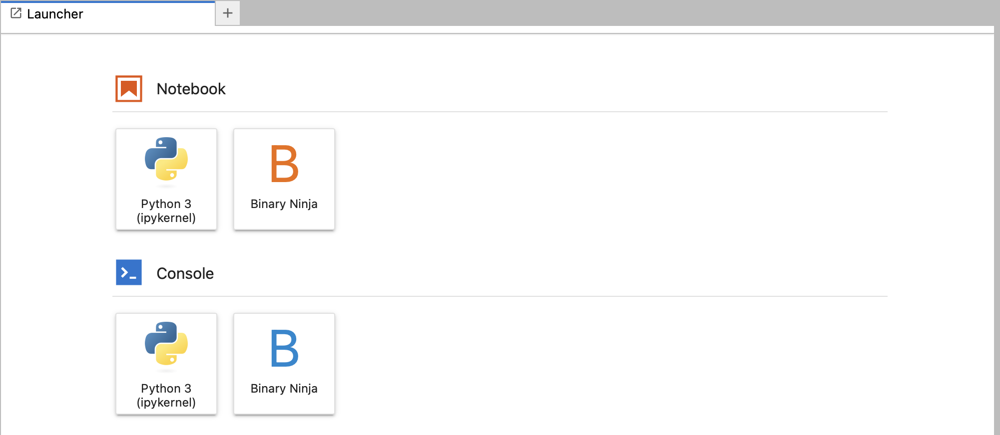

# Using jupyter lab / notebook with IPyBinja

NOTE: experimental

## Installation

From Binary Ninja click "Install Jupyter Kernel" from Menu -> Plugins -> IPyBinja 

## Usage

Use the "Binary Ninja" button from Jupyter Lab launcher tab to create notebooks that use Binary Ninja Kernel

